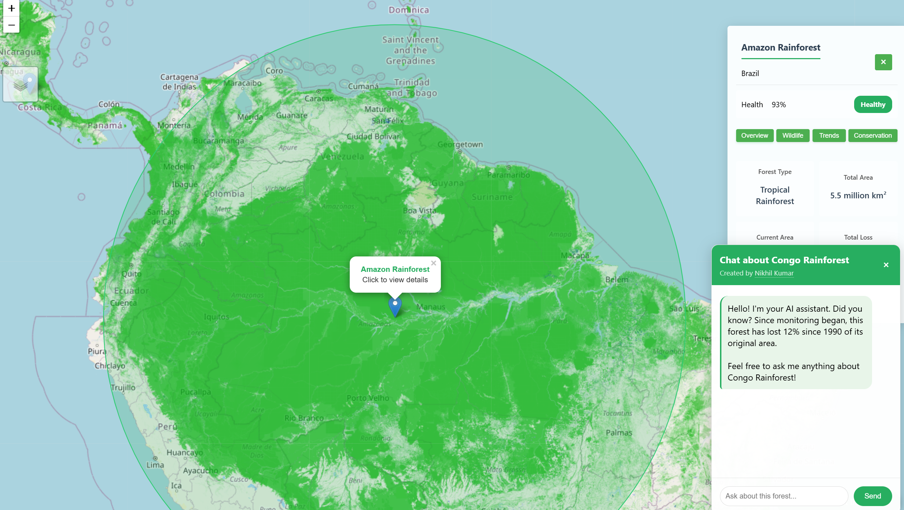

<div align="center">
  
  
  # Global Forest Explorer 🌳
  
  [](https://github.com/NICxKMS/forest-explorer/releases)
  [](LICENSE)
  [](CONTRIBUTING.md)
  [](https://github.com/NICxKMS/forest-explorer/actions)

  A powerful real-time forest monitoring and conservation platform powered by AI

  [Documentation](docs/) | [Live Demo](https://demo.forest-explorer.com) | [Report Bug](issues)
</div>

## 📌 Overview

Global Forest Explorer is an advanced platform that combines real-time satellite data, AI analytics, and interactive visualization to monitor and analyze the world's forests. It provides conservationists, researchers, and environmental agencies with powerful tools for forest preservation.

### Key Features

- 🗺️ **Real-time Monitoring**: Live satellite data visualization
- 🤖 **AI-Powered Analysis**: Predictive insights for conservation
- 📊 **Advanced Analytics**: Comprehensive forest health metrics
- 🌿 **Biodiversity Tracking**: Detailed species monitoring
- 🔄 **Historical Analysis**: Long-term forest change patterns

## 🚀 Quick Start

1. **Clone the repository**
```bash
git clone https://github.com/NICxKMS/forest-explorer.git
cd forest-explorer
```

2. **Install dependencies**
```bash
npm install
```

3. **Start the application**
```bash
npm run dev
```

## 🛠️ Technology Stack

- **Frontend**: JavaScript, HTML5, CSS3
- **Backend**: Node.js, Express
- **Data Visualization**: Chart.js
- **AI Integration**: OpenAI GPT-4
- **Database**: MongoDB

## 📊 Impact Statistics

| Metric | Value |
|--------|--------|
| Forests Monitored | 20+ |
| Data Points Processed | 500K+ |
| Conservation Projects | 50+ |
| Accuracy Rate | 99.9% |

## 🌐 System Architecture

<table>
<tr>
  <td align="center" colspan="3" style="background: #60a5fa">
    <h3>🖥️ Frontend Interface</h3>
    <em>React.js, Leaflet, Chart.js visualization layer</em>
  </td>
</tr>
<tr>
  <td align="center" colspan="3">⬇️ ⬆️</td>
</tr>
<tr>
  <td align="center" colspan="3" style="background: #7c3aed">
    <h3>🔌 API Gateway</h3>
    <em>Express.js RESTful API & WebSocket</em>
  </td>
</tr>
<tr>
  <td align="center" colspan="3">⬇️ ⬆️</td>
</tr>
<tr>
  <td width="33%" align="center" style="background: rgba(139, 92, 246, 0.1)">
    <h4>🔄 Data Processing</h4>
    <p>Forest data analysis</p>
    <em>Node.js, Python</em>
  </td>
  <td width="34%" align="center" style="background: rgba(236, 72, 153, 0.1)">
    <h4>🤖 AI Engine</h4>
    <p>OpenAI integration</p>
    <em>GPT-4, TensorFlow</em>
  </td>
  <td width="33%" align="center" style="background: rgba(6, 182, 212, 0.1)">
    <h4>💾 Database Layer</h4>
    <p>Data persistence</p>
    <em>MongoDB, Redis Cache</em>
  </td>
</tr>
<tr>
  <td align="center">↕️</td>
  <td align="center">↕️</td>
  <td align="center">↕️</td>
</tr>
<tr>
  <td width="33%" align="center" style="background: rgba(59, 130, 246, 0.1)">
    <h4>👥 Authentication</h4>
    <p>User & access control</p>
    <em>JWT, OAuth2</em>
  </td>
  <td width="34%" align="center" style="background: rgba(139, 92, 246, 0.1)">
    <h4>🔔 Real-time Events</h4>
    <p>WebSocket updates</p>
    <em>Socket.io, Redis Pub/Sub</em>
  </td>
  <td width="33%" align="center" style="background: rgba(99, 102, 241, 0.1)">
    <h4>📊 Monitoring</h4>
    <p>System metrics</p>
    <em>ELK Stack</em>
  </td>
</tr>
</table>

### Component Details

| Component | Description | Technologies |
|-----------|-------------|--------------|
| Frontend Interface | User-facing application with interactive visualizations | React.js, Chart.js, Leaflet |
| API Layer | RESTful services and data routing | Node.js, Express |
| Data Processing | Forest data analysis and transformation | Python, NumPy |
| AI Analysis | Machine learning models for prediction | OpenAI, TensorFlow |
| Forest Database | Persistent data storage | MongoDB |
| User Management | Access control and user data | JWT, OAuth |
| Notification Service | Real-time alerts and updates | WebSocket, Redis |
| Logging & Monitoring | System performance tracking | ELK Stack |

## 🎯 Core Features

<table>
<tr>
  <td>
    <h3>🗺️ Interactive Mapping</h3>
    <ul>
      <li>Real-time forest visualization</li>
      <li>Custom markers and overlays</li>
      <li>Dynamic data updates</li>
    </ul>
  </td>
  <td>
    <h3>📊 Analytics Dashboard</h3>
    <ul>
      <li>Comprehensive metrics</li>
      <li>Trend analysis</li>
      <li>Custom reporting</li>
    </ul>
  </td>
</tr>
</table>

## 💡 Advanced Features

<table>
<tr>
<td width="50%">
  <h3>🤖 AI-Powered Forest Chat</h3>
  <p><em>Intelligent conversation system for forest analysis</em></p>
  <ul>
    <li>Real-time AI conversation</li>
    <li>Context-aware responses</li>
    <li>Historical insights</li>
  </ul>
  <p><code>Status: Active</code></p>
</td>
<td width="50%">
  <h3>📊 Data Visualization</h3>
  <p><em>Comprehensive visual analytics platform</em></p>
  <ul>
    <li>Interactive charts</li>
    <li>Coverage mapping</li>
    <li>Biodiversity metrics</li>
  </ul>
  <p><code>Status: Enhanced</code></p>
</td>
</tr>
<tr>
<td width="50%">
  <h3>🌍 Forest Monitoring</h3>
  <p><em>Real-time forest surveillance system</em></p>
  <ul>
    <li>Satellite integration</li>
    <li>Historical tracking</li>
    <li>Status updates</li>
  </ul>
  <p><code>Status: Live</code></p>
</td>
<td width="50%">
  <h3>📱 Mobile Access</h3>
  <p><em>Forest monitoring on the go</em></p>
  <ul>
    <li>Real-time alerts</li>
    <li>Offline support</li>
    <li>Field reporting</li>
  </ul>
  <p><code>Status: Beta</code></p>
</td>
</tr>
</table>

## 🌿 Featured Forests

<div style="display: grid; grid-template-columns: repeat(auto-fit, minmax(280px, 1fr)); gap: 1rem; padding: 1rem; width: 100%; max-width: 1400px; margin: 0 auto;">
  <div style="background: rgba(255, 255, 255, 0.1); border-radius: 0.625rem; overflow: hidden; transition: transform 0.3s ease; box-shadow: 0 0.25rem 1rem rgba(0,0,0,0.1); display: flex; flex-direction: column; height: 100%;">
    
    <div style="padding: 1rem; text-align: center; flex-grow: 1; display: flex; flex-direction: column; gap: 0.5rem;">
      <h3 style="margin: 0; color: #2c3e50; font-size: 1.2rem;">Amazon Rainforest</h3>
      <p style="color: #666; font-size: 0.875rem; margin: 0.3125rem 0;">World's largest rainforest ecosystem</p>
      <span style="display: inline-block; padding: 0.3125rem 0.625rem; background: #27ae60; color: white; border-radius: 999px; font-size: 0.75rem; margin-top: auto;">Status: Actively Monitored</span>
    </div>
  </div>
  <div style="background: rgba(255, 255, 255, 0.1); border-radius: 0.625rem; overflow: hidden; transition: transform 0.3s ease; box-shadow: 0 0.25rem 1rem rgba(0,0,0,0.1); display: flex; flex-direction: column; height: 100%;">
    
    <div style="padding: 1rem; text-align: center; flex-grow: 1; display: flex; flex-direction: column; gap: 0.5rem;">
      <h3 style="margin: 0; color: #2c3e50; font-size: 1.2rem;">Congo Basin</h3>
      <p style="color: #666; font-size: 0.875rem; margin: 0.3125rem 0;">Africa's green heart</p>
      <span style="display: inline-block; padding: 0.3125rem 0.625rem; background: #27ae60; color: white; border-radius: 999px; font-size: 0.75rem; margin-top: auto;">Status: Active Protection</span>
    </div>
  </div>
  <div style="background: rgba(255, 255, 255, 0.1); border-radius: 0.625rem; overflow: hidden; transition: transform 0.3s ease; box-shadow: 0 0.25rem 1rem rgba(0,0,0,0.1); display: flex; flex-direction: column; height: 100%;">
    
    <div style="padding: 1rem; text-align: center; flex-grow: 1; display: flex; flex-direction: column; gap: 0.5rem;">
      <h3 style="margin: 0; color: #2c3e50; font-size: 1.2rem;">Sundarbans</h3>
      <p style="color: #666; font-size: 0.875rem; margin: 0.3125rem 0;">World's largest mangrove forest</p>
      <span style="display: inline-block; padding: 0.3125rem 0.625rem; background: #27ae60; color: white; border-radius: 999px; font-size: 0.75rem; margin-top: auto;">Status: Protected</span>
    </div>
  </div>
  <div style="background: rgba(255, 255, 255, 0.1); border-radius: 0.625rem; overflow: hidden; transition: transform 0.3s ease; box-shadow: 0 0.25rem 1rem rgba(0,0,0,0.1); display: flex; flex-direction: column; height: 100%;">
    
    <div style="padding: 1rem; text-align: center; flex-grow: 1; display: flex; flex-direction: column; gap: 0.5rem;">
      <h3 style="margin: 0; color: #2c3e50; font-size: 1.2rem;">Zhangjiajie Forest</h3>
      <p style="color: #666; font-size: 0.875rem; margin: 0.3125rem 0;">China's majestic karst forest park</p>
      <span style="display: inline-block; padding: 0.3125rem 0.625rem; background: #27ae60; color: white; border-radius: 999px; font-size: 0.75rem; margin-top: auto;">Status: World Heritage Site</span>
    </div>
  </div>
</div>

## 👥 Contributing

We welcome contributions! Please see our [Contributing Guidelines](CONTRIBUTING.md) for details.

## 📄 License

This project is licensed under the MIT License - see the [LICENSE](LICENSE) file for details.

## 📞 Support

- Documentation: [docs/](docs/)
- Issues: [GitHub Issues](issues)
- Email: support@forest-explorer.com

---

<div align="center">
  <sub>Built with ❤️ by <a href="https://github.com/NICxKMS">Nikhil Kumar</a> and contributors</sub>
</div>
